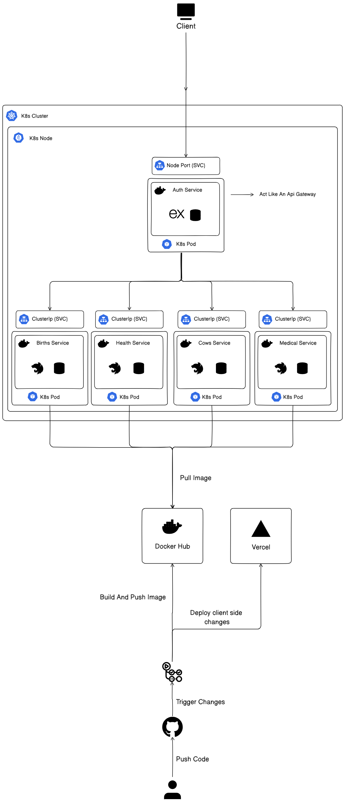

# Microservices Backend System

This project is a microservices-based backend architecture designed to handle a variety of functionalities through separate, modular services. Each service has its own deployment, scaling, and resource allocation, ensuring high availability and fault tolerance.

## Table of Contents

1. [Overview](#overview)
2. [Architecture](#architecture)
3. [Services](#services)
4. [Deployment](#deployment)
5. [Resource Management](#resource-management)
6. [Getting Started](#getting-started)

## Overview

This backend system consists of multiple microservices, each handling a specific domain, including:

- **Authentication and API Gateway**
- **Birth Registration Service**
- **Cattle Management Service**
- **Medical Examination Service**
- **Milk Production Service**

These microservices communicate via HTTP and are deployed as independent units, each with its own Kubernetes configuration.

## Architecture

- **API Gateway**: Serves as the entry point for all incoming requests, routing them to the appropriate microservices.
- **Independent Microservices**: Each service handles a specific domain and can be independently scaled.
- **Kubernetes Orchestration**: Ensures automated deployments, scaling, and management.

## Services

### 1. Auth API Gateway

- **Image**: `msbihaladdin/api-gateway:latest`
- **Purpose**: Centralized API gateway for authentication and routing.
- **Ports**: Exposed at `8080` internally and `30080` externally (NodePort).

### 2. Birth Registration Service

- **Image**: `msbihaladdin/birth-registration-service:latest`
- **Purpose**: Manages birth registration data.
- **Ports**: Exposed at `3003`.

### 3. Cattle Management Service

- **Image**: `msbihaladdin/cattle-service:latest`
- **Purpose**: Handles cattle-related data and operations.
- **Ports**: Exposed at `3001`.

### 4. Medical Examination Service

- **Image**: `msbihaladdin/medical-examination-service:latest`
- **Purpose**: Manages medical examination records.
- **Ports**: Exposed at `3002`.

### 5. Milk Production Service

- **Image**: `msbihaladdin/milk-production-service:latest`
- **Purpose**: Handles milk production data.
- **Ports**: Exposed at `3004`.

## Deployment

### Kubernetes Configurations

Each service is deployed as a Kubernetes deployment and exposed via a service:

1. **Deployments**
   - YAML configurations specify container images, resource requests, and limits.
2. **Services**
   - ClusterIP services for internal communication.
   - NodePort service for external access to the API Gateway.

### Example Commands

To deploy a service:

```bash
gkubectl apply -f <service-deployment.yaml>
kubectl apply -f <service-service.yaml>
```

### Persistent Volumes

Persistent storage (PVCs) can be added for services requiring data persistence.

## Resource Management

- **Resource Requests and Limits**:
  - Each service requests `100m` CPU and `128Mi` memory by default.
  - Limits are set to `250m` CPU and `256Mi` memory.
- **Scalability**:
  - Kubernetes Horizontal Pod Autoscaler (HPA) can be configured to scale services dynamically based on CPU or memory usage.

## Getting Started

1. **Prerequisites**

   - Kubernetes Cluster
   - kubectl CLI
2. **Setup**

   - Apply the Kubernetes configurations for each service:
     ```bash
     cd infra/k8s
     kubectl apply -f .
     ```
3. **Verify Deployments**

   - Check the status of your pods:
     ```bash
     kubectl get pods
     ```
   - Verify services:
     ```bash
     kubectl get services
     ```

### Notes:

- For persistent volume claims (PVCs), uncomment the respective sections in the YAML files.
- Ensure proper resource allocation to avoid overloading the cluster.

## Diagram

### App Architecture Overview


